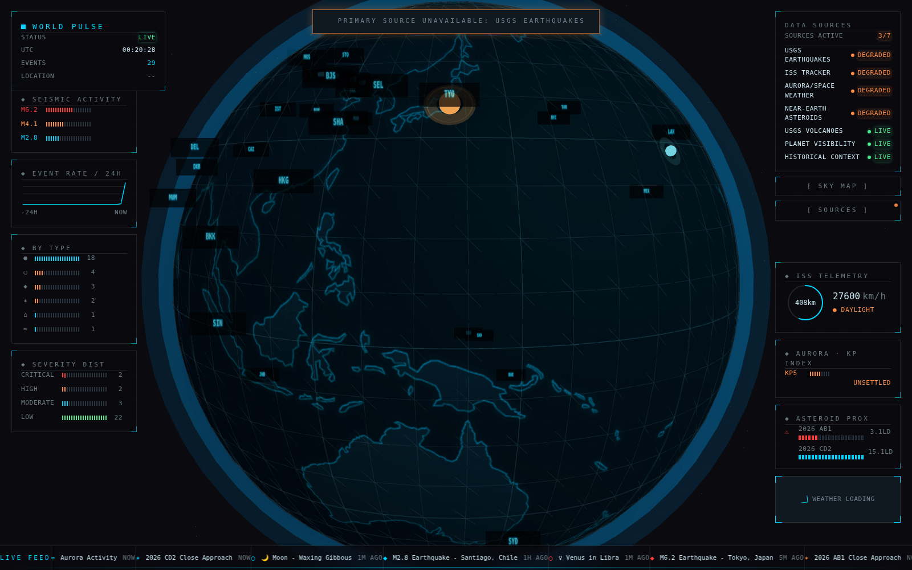

# World Pulse 🌍

> A real-time information radiator visualizing global events on an interactive 3D globe.

**Status:** 🟢 Phase 1 (backend + MVP globe) substantially complete  
**Version:** 0.2.0

---

## What Is This?

World Pulse is a 24/7 ambient dashboard, designed to run on dedicated hardware (TV, iPad, monitor), that streams live global events from plugin-based collectors and renders them on a dark "Oblivion"-styled 3D globe. It combines:

- 🌍 Real-time global events (earthquakes, ISS position, aurora/space weather, near-Earth asteroids, weather, volcanoes, planet visibility)
- 🛰️ Mission-control side-column telemetry widgets (seismic activity, event rate, type/severity distribution, ISS/aurora/asteroid readouts)
- 📜 A live scrolling event ticker and degraded/connection-status HUD panels

All visualized on a 3D globe with supporting dashboards.



---

## Quick Start

**Prerequisites:**
- Node.js 20+ LTS
- npm or pnpm
- macOS/Windows/Linux

**Setup:**
```bash
# Clone the repository
git clone <repo-url>
cd world-pulse

# Install dependencies
npm install

# Copy environment template
cp .env.example .env.local

# Add your API keys to .env.local
# (See API Keys section below)

# Start development server
npm run dev

# Or launch in Electron
npm run dev:electron
```

---

## API Keys

You'll need free API keys for:

1. **OpenWeather** - [Get key](https://openweathermap.org/api)
2. **NewsAPI** - [Get key](https://newsapi.org/)
3. **NASA** (optional, for the Near-Earth Asteroids collector) - [Get key](https://api.nasa.gov/) — defaults to `DEMO_KEY` (rate-limited) if unset
4. **Spotify** (optional) - [Get credentials](https://developer.spotify.com/)

Add them to `.env.local`:
```env
OPENWEATHER_API_KEY=your_key_here
NEWSAPI_KEY=your_key_here
NASA_API_KEY=your_key_here
SPOTIFY_CLIENT_ID=your_id_here
SPOTIFY_CLIENT_SECRET=your_secret_here
```

---

## Project Structure

```
world-pulse/
├── src/
│   ├── renderer/          # React frontend (Vite + Three.js)
│   │   ├── components/    # Dashboard, Globe, HUD panels, SideColumns, Ticker
│   │   ├── hooks/         # useSocket, etc.
│   │   ├── store/         # Zustand state management (useAppStore)
│   │   └── index.css      # Oblivion design system
│   ├── server/            # Node.js backend (Express + Socket.io)
│   │   └── collectors/    # Plugin-based data source collectors
│   └── shared/            # Shared TypeScript types/constants
├── docs/                  # ADRs, specs, prototypes, screenshots
├── .github/                # CI/CD workflows
└── SPEC.md                 # Technical specification
```

---

## Development Commands

```bash
npm run dev              # Start dev server (frontend + backend)
npm run dev:server       # Start backend only
npm run dev:renderer     # Start frontend only
npm run dev:electron     # Launch Electron wrapper
npm test                 # Run all tests
npm run test:watch       # Run tests in watch mode
npm run test:coverage    # Run tests with coverage
npm run test:e2e         # Run Playwright E2E tests
npm run lint             # Check code style
npm run lint:fix         # Autofix lint issues
npm run format           # Format with Prettier
npm run typecheck        # TypeScript type checking
npm run validate         # Full pre-push check: typecheck + test + lint + build
npm run build            # Production build (renderer + server)
npm run build:electron   # Package desktop app
```

---

## Documentation

- [Technical Specification](./SPEC.md) - Architecture, tech stack, roadmap
- [Contributing Guide](./CONTRIBUTING.md) - Development workflow
- [Architecture Overview](./ARCHITECTURE.md) - System design
- [Release Process & Manual Recovery](./docs/RELEASE.md) - How releases publish, how auto-update works, and how to roll back a broken release
- [docs/](./docs) - ADRs, specs, and prototypes per feature

---

## Roadmap

**Phase 1 (MVP):** Globe rendering + earthquakes + weather + basic ticker  
**Phase 2:** News sentiment heat map  
**Phase 3:** Personal calendar integration  
**Phase 4:** Music, astronomy, ocean data  
**Phase 5:** Production polish + auto-updates  
**Phase 6:** Web deployment option

See [SPEC.md](./SPEC.md) for detailed milestones.

---

## Tech Stack

- **Frontend:** React + Three.js + Tailwind CSS
- **Backend:** Node.js + Express + Socket.io
- **Desktop:** Electron
- **Database:** SQLite
- **Testing:** Vitest + Playwright
- **Language:** TypeScript

---

## Security

This project follows security best practices:
- No secrets in code (use `.env.local`)
- Regular dependency updates via Dependabot
- CVE scanning in CI
- HTTPS-only external API calls

See [Security Policy](./SECURITY.md) for reporting vulnerabilities.

---

## License

MIT (or choose your license)

---

## Credits

Inspired by:
- The visual aesthetics of *Oblivion* and *The Matrix*
- GitHub's global activity visualizations
- Real-time security attack maps

Built by Dan Goldman with Amp 🎸
